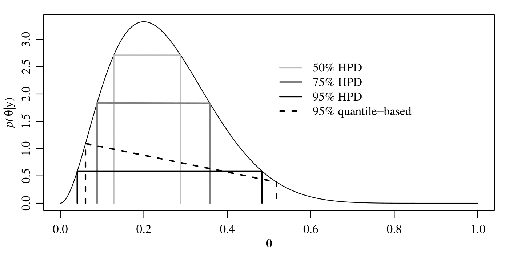

# Disclaimer

This session's material comes from Ch. 1,2 and 3 of Hoff's book.


Hoff, P. D. (2009). A first course in Bayesian statistical methods (Vol. 580). New York: Springer.


---

# Probability and Bayesian inference

* Informally: a way to express our degree of certainty about unknown things.
   
* Formally: a numerical way of representing rational beliefs.

* There is a relation between probability and information.

* Bayes' rule is a rational method for updating beliefs given new information.

---

# Bayesian learning (on a nutshell)

* Statistical induction: Learn about population given sample.

* Learn about $\theta$ given dataset $y$.

* After observing dataset, we have less uncertainty about $\theta$ than before. Bayes **quantifies** this change.

* Notation: sample space $\mathcal{Y}$; parameter space $\Theta$.

---

# Bayesian learning (on a nutshell)

* The process:
  
  1. Set a *prior* $p(\theta)$ describing our belief that $\theta$ represents the truth.
  
  2. Set a *sampling model* $p(y \vert \theta)$ that describes our belief that $y$ would be the outcome of our study if $\theta$ wa true.
  
  3. Compute *posterior* $p(\theta \vert y)$, that describes our belief that $\theta$ is the truth after having observed $y$.
  
  $$
  p(\theta \vert y) = \frac{p(y \vert \theta) p(\theta)}{\int_{\Theta} p(y \vert \tilde{\theta}) p(\tilde{\theta}) d \tilde{\theta}}
  $$
  
* Mathematical justification in Savage(1954, 1972).

---

# Beliefs

* Say, $Be(F)$, represents **numerically** our beliefs about a statement.

* Can be formalized using bets ($Be(F) > Be(G)$ means we would prefer to bet $F$ is true than $G$ is true).

* Axioms of beliefs:

  1. $Be(\text{not } H | H ) \leq Be(F | H ) \leq Be( H | H )$
  
  2. $Be( F \text{or } G | H ) \geq  \max \lbrace Be(F | H ), Be(G | H ) \rbrace$
  
  3. $Be( F \text{and } G | H ) \text{ can be derived from } Be(G | H ) \text{ and } Be(F | G \text{ and } H)\rbrace$
  

* Probability satisfies this axioms.


---

# Exchangeability

* Let $p(y_1, \dots, y_n)$ be the joint density for $Y_1, \dots, Y_n$. If $p(y_1, \dots, y_n) = p(y_{\pi_1}, \dots, y_{\pi_n})$ for all permutations $\pi$ then $Y_1, \dots, Y_n$ are exchangeable.

* If $\theta \sim p(\theta)$ and $Y_1, \dots, Y_n$ are conditionally i.i.d. given $\theta$, then marginally $Y_1, \dots, Y_n$ are exchangeable. (Proof it).

* The other way around? De Finetti's theorem.

---

# De Finetti's theorem

Suppose that $\lbrace Y_1, Y_2, \dots  \rbrace$ is a potentially infinite sequence of random variables with common sampling space.

If for any $n$ $Y_1, \dots, Y_n$ is exchangeable, then
$$
p(y_1, \dots, y_n) = \int \left \lbrace \Pi_1^n p(y_i \vert \theta) \right \rbrace p(\theta) d \theta
$$

  for some parameter $\theta$, some prior and sampling model, that depend on our belief model   $p(y_1, \dots, y_n)$.

---

class: middle, center, inverse

# One-parameter models

---
# The binomial model

* A sample of 129 people (from a population of $N$) are asked whether or not they are happy. $Y_i=1$ if happy $Y_i=0$ if not.

* $\theta = \sum_{i=1}^N Y_{i} / N$.

* $p(y_1, \dots, y_n \vert \theta) = \theta^{\sum_{i=1}^{129} y_i} (1-\theta)^{129 -\sum_{i=1}^{129} y_i}$

* Prior?

---

# Uniform prior

* $p(\theta) = 1$ for all $\theta \in [0,1]$.

* Posterior? Using Bayes rule: 

\begin{equation*}
p(\theta \vert y_1, \dots, y_{129}) = \frac{p(y_1, \dots, y_{129} \vert \theta ) p(\theta)}{p(y_1, \dots, y_n)}
\end{equation*}

\begin{equation*}
p(\theta \vert y_1, \dots, y_{129}) \propto \theta^{118} (1-\theta)^{11}
\end{equation*}

* Identificar con núcleo de distribución Beta de parámteros $a=119$ y $b=12$.

\begin{equation*}
\frac{x^{a-1}(1-x)^{b-1}} {B(a,b)}\!
\end{equation*}

---

# Uniform and beta prior

* Same result for every sequence with the same number of 1s.

* $y = \sum_{i} y_i$ is a sufficient statistic.

--

* $p(y | \theta) = \binom{n}{y} \theta^y (1-\theta)^y$

* Posterior: $p(\theta | y) = \text{beta}(y+1, n-y+1)$ .

* Uniform is a particular case of beta (with parameters 1, 1). What if we choose a general beta prior?

\begin{equation*}
p(\theta | y ) \propto p(\theta)p(y | \theta) = \theta^{a+y-1} (1-\theta)^{b+n-y-1}
\end{equation*}

* So $p(\theta | y) = beta(a+y, b + n -y)$

---

# Conjugacy

* A class $\mathcal{P}$ of prior distributions for $\theta$ is called cojugate for a sampling model $p(y | \theta)$ if
\begin{equation*}
p(\theta) \in \mathcal{P} \Rightarrow p(\theta \vert y) \in \mathcal{P}
\end{equation*}
Make life easier... but we loose flexibility.

* Note that
\begin{eqnarray*}
\text{E}[\theta | y] = \frac{a+y}{a+b+n} = 
\end{eqnarray*}
\begin{eqnarray*}
\frac{a+b}{a+b+n} \times \text{prior expectation} +  \frac{n}{a+b+n} \times \text{data avg.}
\end{eqnarray*}
Take a look at the asymptotic behaviour...

---
# The example

```{r, echo=F}
load("data/gss.RData") 

y<-gss[gss$YEAR==1998 & gss$AGE>=65 & gss$FEMALE==1, ]$HAPUNHAP
y[y>4]<-NA
y[y<=2]<-1 
y[y>2]<-0
y<-y[!is.na(y) ]
sy<-sum(y)
n<-length(y)

par(mar=c(3,3,1,1),mgp=c(1.75,.75,0))
par(mfrow=c(2,1))

plot(theta,dbeta(theta,sy+1,n-sy+1),type="l",ylab=
expression(paste(italic("p"),"(",theta,"|",italic(y),")",sep="")),xlab=expression(theta))
abline(h=1,col="gray")

a=5
b=15
plot(theta,dbeta(theta,sy+a,n-sy+b),type="l",ylab=
expression(paste(italic("p"),"(",theta,"|",italic(y),")",sep="")),xlab=expression(theta))
lines(theta,dbeta(theta,a,b), type="l", col="gray")
```


--- 


---
# Prediction

* Say we want to predict a new observation.

* Bayesian data analysis does it in a formal way

\begin{equation*}
\text{Pr}(\tilde{Y} = 1 \vert y_1, \dots, y_n) = \int \text{Pr}(\tilde{Y} = 1 \vert \theta, y_1, \dots, y_n) p(\theta \vert y_1, \dots, y_n) d \theta
\end{equation*}
\begin{equation*}
 = \int \theta p(\theta \vert y_1, \dots, y_n ) d \theta = \frac{a+ \sum_{i=1}^n y_i}{a+b+n}
\end{equation*}


---
# Confidence regios

* We can ask the posterior **any question**...

* ... like which are the regions of the parameter space that are likely to contain the true value of the parameter.

* **Bayesian coverage** An interval $[l(y), u(y)]$ has $95 \%$ of Bayesian coverage for $\theta$ if 

\begin{equation*}
\text{Pr}(l(y) < \theta < u(y)) | Y=y) = 0.95
\end{equation*}

* **Highest posterior density region**: a $100 \times (1-\alpha) \%$ HDP region consist of a subset $s(y)$ of the parameter space such that
  
  1. The probability that the true value lies within the region is $1-\alpha$
  2. If $\theta_a \in s(y)$, and $\theta_b \notin s(y)$ then $p(\theta_a | Y=y) > p(\theta_b | Y=y)$
  
---

# Example


---

# The Poisson model

* Say $\mathcal{Y} = \lbrace 0, 1, 2, \dots \rbrace$

* If we model $Y_1, \dots, Y_n$ as conditional iid samples from a Poisson of mean $\theta$

\begin{equation*}
text{Pr} (Y_1=y_1, \dots, Y_n=y_n \vert \theta) \prod_{i=1}^n \frac{1}{y_i !} \theta^{y_i} e^{-n \theta} \propto \theta^{\sum y_i} e^{-n \theta}
\end{equation*}

* $\sum_{i=1}^n Y_i$ is sufficient, and $\sum_{i=1}^n Y_i \vert \theta \sim \text{Poisson}(n\theta)$.

* What is the form of the conjugate prior? 

---

# Conjugate prior 

* Gamma distribution $p(\theta) = \frac{b^a}{\Gamma(a)} \theta^{a-1} e^{-b \theta}$.

* Posterior is a $\text{gamma} (a + \sum_{i=1}^n Y_i,  b+n)$ (try!).

\begin{equation*}
\text{E}[\theta \vert y_1, \dots, y_n] = \frac{b}{b+n}\frac{a}{b} + \frac{n}{b+n} \frac{\sum_i y_i}{n}
\end{equation*}

* Predictive:

\begin{equation*}
p(\tilde{y} \vert y_1, \dots, y_n) = \int p(\tilde{y} \vert \theta) p(\theta \vert y_1, \dots, y_n) d \theta
\end{equation*}

* Easy to solve... the predictive is a negative binomial.

\begin{equation*}
 \text{E}[\tilde{Y} \vert y_1, \dots, y_n] = \frac{a+ \sum_i y_i}{b+n}
\end{equation*}

\begin{equation*}
 \text{Var}[\tilde{Y} \vert y_1, \dots, y_n] = \text{E}[\theta \vert y_1, \dots, y_n]\times \frac{b+n+1}{b+n}
\end{equation*}


---
# The normal model

* If our sampling model is normal with mean $\theta$ and variance $\sigma^2$

\begin{equation*}
p(y_1, \dots, y_n \vert \theta, \sigma^2) \propto \exp \left \lbrace -\frac{1}{2} \sum \left( \frac{y_i - \theta}{\sigma}\right)^2 \right \rbrace
\end{equation*}

* Assume we know the variance. Conjugate prior on $\theta$ is normal $(\mu_0, \tau_0^2)$.

* Posterior is normal 

\begin{equation*}
\mu_n = \frac{\tilde{\tau}_0^2}{\tilde{\tau}_0^2 + n \tilde{\sigma}^2} \mu_0 +\frac{n \tilde{\sigma}^2}{\tilde{\tau}_0^2 + n \tilde{\sigma}^2}\bar{y}
\end{equation*}

\begin{equation*}
\tilde{\tau}_n^2 = \tilde{\tau}_0^2 + n \tilde{\sigma}^2 
\end{equation*}

* The predictive is a normal $(\mu_n, \tau_n^2 + \sigma^2)$


---
# Regression

---

class: middle, center, inverse

# More than one-parameter models

---

# The normal model
