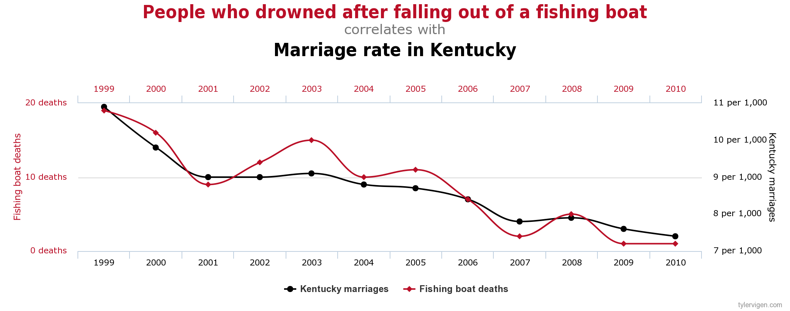

# Modern research (ML and Bayes)

* NLP.

* RL.

* Interpretability and Explainability.

* Fairness.

* Causal Inference.

* Scalable Bayesian Inference.

* Adversarial ML.

---

# NLP - Arms race

* Pre-trained language models + fine tuning

* Wu Dao 1.75 **trillion parameters**!!
---
# NLP - Research

* Architecture design.

* Applications.

  1. Dialog systems.
  2. Emotion recognition.
  3. Computer vision + NLP.s

* Theoretical results?

* Non democratic... only accesible to people with data and computational power (google, facebook, ...)

---
# Reinforcenment Learning

* According to a lot of people, the way to AGI.

* Multi-agent RL.

* Many applications.

---
# Interpretability & Explainability

* Black-box algorithms are not always applicable.

* We need algorithms to tell us why the make the decisions.

* **Interpretability**: use algorithms that are interpretable per se.

* **Explainability**: use black box algorithms and ellaborate explanations a posteriori.

  * The do not explain reality!!
  
* Rashomon sets
  
Rudin, C. (2019). Stop explaining black box machine learning models for high stakes decisions and use interpretable models instead. Nature Machine Intelligence, 1(5), 206-215.

---
# Fairness - Bias in ML

* Data is biased $\rightarrow$ algorithms are biased

---
# Fairness - Bias in ML

---
# Research on Fairness

* Definition.

* How to **guarantee** that models are not using, e.g., racial information?

* Uncovering biases.

* Interpretability...

---
# Causal Inference

* Data will provide associations between variables...

* ... to do science we need to measure **causation**!

---
# Correlation is not causation

---
# Causal Inference

* The model is **key**!

---
# Causal Inference

* Can we determine cause-effect relations using data?

* Under some circumstances, and some assumptions, yes.

* Essentially, we assume that we observe every confounder.

* Research on how to adjust for every confounder...

* And on applications.

---
# Scalable Bayesian Inference

---
# Adversarial Machine Learning

* Automation using ML increases... attempts to cheat ML systems increases.

---
# Adversarial Machine Learning

---
# Adversarial Machine Learning

* Make ML algorithms **robust** against likely attacks.

* Idea: formalize confrontation between algorithm and adversary as a **game**.

* Compute **Nash equilibrium** and use it as robust solution.

* Common Knowledge?

* Bayesian games, adversarial risk analysis?

---

